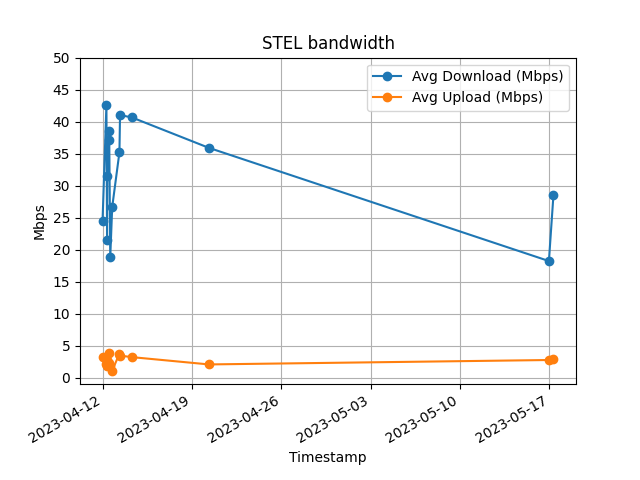

# Readme

This repo contains a few utility scripts that help me tracking my Internet provider's bandwidth. It works on macOS, some packages might need to be installed if not already present.

The entrypoint is `./STEL_bandwidth_test.sh`, that in turn:

- runs `1_run_speedtests.sh`, that runs 5 times the OKLA's `speedtest` CLI specifying the server I have to connect to (change it, if you need). Results in `json` format are saved in the `data` folder.
- runs `2_average_results.sh`, that gets the `json` files and averages the results into human readable `txt` files in the `reports` folder.
- runs `3_generate_csv_from_txt.sh`, that extracts data from the `txt` files and bundles it into a single `reports/speedtest_data.csv`. I know, I should have calculated the `csv` from the `json`s instead, but I got to this collection of scripts gradually, so...
- runs `4_run_plot.sh`, which in turn runs the Python script `plot_data.py`, that saves an `output.png` file and displays it.

Something like this:

I should stick this into a cron job, but the whole thing makes sense only if nobody else in the house is sucking data from the Internet while the tests are running: I just manually launch it when needed.

The whole shebang has been patched together with ChatGTP and a lot of prompting: it's tailored to my own needs, but it's free, grab it, tweak it, do whatever you want.

Cheers from Italy!